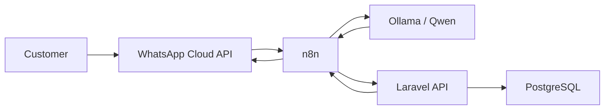

<div align="center">

# FrontDesk AI

### AI-Powered WhatsApp Receptionist & Appointment Automation

**A bilingual AI agent that turns natural WhatsApp conversations into confirmed appointments.**

Arabic & English · Multi-turn Memory · Real WhatsApp Integration · Local AI

<br>


</div>

---

## The Problem

Clinics, salons, and service businesses still spend significant time handling appointment requests manually through WhatsApp.

A typical customer may send messages like:

```text
"Can I book a teeth cleaning tomorrow around four?"
```

The business then has to manually identify the service, clarify the time, check availability, create the appointment, and send a confirmation.

The process becomes even harder when conversations happen across multiple messages.

---

## The Solution

**FrontDesk AI acts as an autonomous WhatsApp receptionist.**

It understands natural conversations in **Arabic and English**, remembers context between messages, extracts booking information, checks appointment availability, and confirms bookings automatically.

Example:

```text
Customer:
I want a teeth cleaning on August 16 at four

FrontDesk AI:
Do you mean AM or PM?

Customer:
PM

FrontDesk AI:
Your Teeth Cleaning appointment has been confirmed
for 2026-08-16 at 16:00.
```

The customer never needs to open a booking form.

---

## Why This Is More Than a Chatbot

FrontDesk AI deliberately separates **AI understanding** from **business decisions**.

```text
Ollama / Qwen
      ↓
Understands what the customer means

Laravel
      ↓
Validates the request and applies booking rules

PostgreSQL
      ↓
Stores customers, appointments and conversation state

n8n
      ↓
Orchestrates the complete WhatsApp workflow
```

The LLM cannot directly create an appointment.

For example, if a customer says:

```text
"at four"
```

without specifying AM or PM, Laravel prevents an AI-generated guess and requires clarification first.

---

## Architecture



---

## What FrontDesk AI Can Do

| Capability | Status |
|---|---|
| Real WhatsApp messaging | ✅ |
| Arabic conversations | ✅ |
| English conversations | ✅ |
| AI intent extraction | ✅ |
| Service recognition | ✅ |
| Appointment booking | ✅ |
| Availability checking | ✅ |
| Conflict detection | ✅ |
| Multi-turn memory | ✅ |
| Ambiguous-time clarification | ✅ |
| Automatic confirmation | ✅ |
| Operations dashboard | ✅ |

---

## Multi-Turn Conversation Memory

FrontDesk AI remembers incomplete requests.

```text
Customer:
أريد حجز تنظيف أسنان يوم 15 أغسطس الساعة الرابعة

FrontDesk AI:
هل تقصد الوقت صباحًا أم مساءً؟

Customer:
مساءً
```

The second message contains almost no booking information by itself.

FrontDesk AI retrieves the stored conversation state and reconstructs:

```json
{
  "intent": "book_appointment",
  "service_name": "تنظيف أسنان",
  "requested_date": "2026-08-15",
  "requested_time": "16:00"
}
```

The appointment can then be validated and created.

---

## Automation Workflow


```text
WhatsApp Trigger
      ↓
Normalize Message
      ↓
Save Customer
      ↓
Classify Intent with Ollama
      ↓
Parse Structured AI Output
      ↓
Laravel Booking Engine
      ↓
Send WhatsApp Reply
```

---

## Operations Dashboard


A React-based operations interface was created to visualize conversations, appointments, AI activity, and system health.

The dashboard is presentation-focused in the current MVP while the booking engine operates independently.

---

## Tech Stack

| Layer | Technology |
|---|---|
| Backend | Laravel 12 · PHP |
| Database | PostgreSQL |
| AI | Ollama · Qwen |
| Automation | n8n |
| Messaging | WhatsApp Business Cloud API |
| Frontend | React · TypeScript · Tailwind CSS |
| Infrastructure | Docker · Docker Compose |
| Development Webhooks | Cloudflare Tunnel |

---

## Database

```text
customers
    │
    ├── appointments
    │
    └── conversation_states

services
    │
    └── appointments
```

`conversation_states` gives the agent temporary memory between WhatsApp messages.

`appointments` remains the source of truth for scheduling.

---

## Run Locally

```bash
git clone https://github.com/eenoo2005-star/FrontDesk-AI.git
cd FrontDesk-AI
docker compose up -d
```

Backend:

```bash
cd backend
composer install
cp .env.example .env
php artisan key:generate
php artisan migrate
php artisan serve --host=0.0.0.0 --port=8000
```

Frontend:

```bash
cd frontend
npm install
npm run dev
```

Ollama must also be running locally with the configured Qwen model.

Production credentials and access tokens are intentionally excluded from the repository.

---

## Project Scope

FrontDesk AI currently focuses on one workflow and implements it end-to-end:

> **Natural conversation → AI understanding → clarification → availability check → appointment creation → WhatsApp confirmation**

Potential production extensions include rescheduling, cancellation, reminders, staff calendars, and configurable business hours.

---

## Built By

### Shaheen Idris

Software Engineering · Backend Development · AI Integration · Workflow Automation

---

<div align="center">

### FrontDesk AI

**Turning appointment booking into a conversation.**

</div>