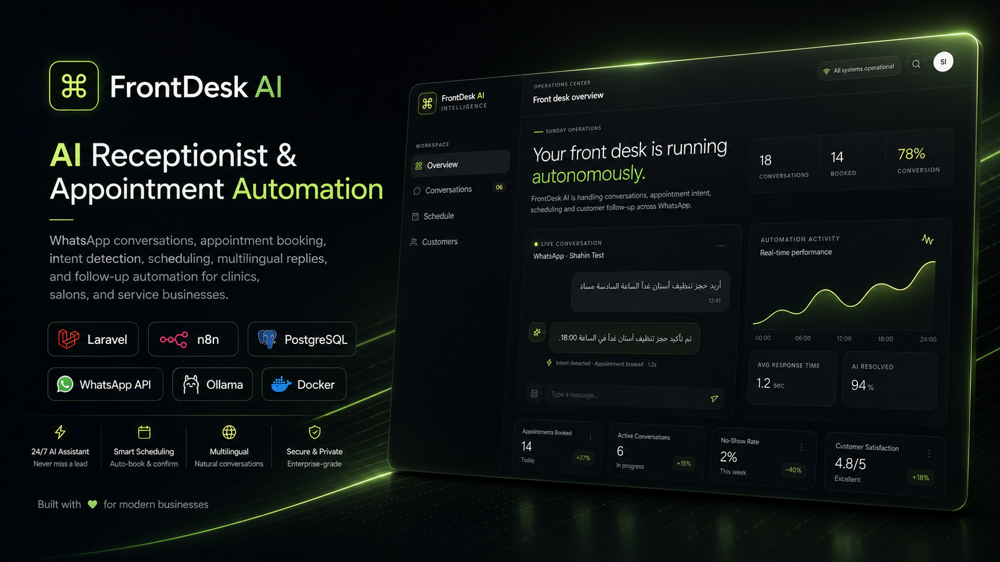
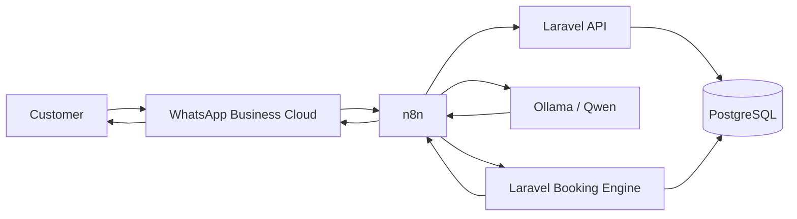
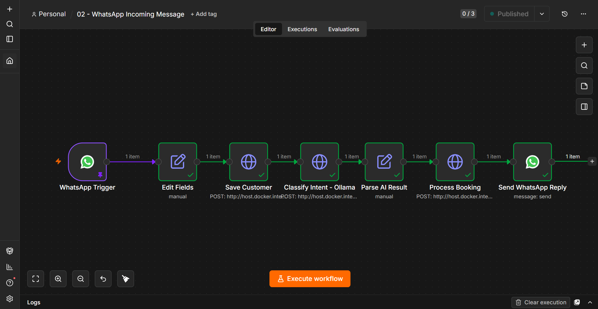
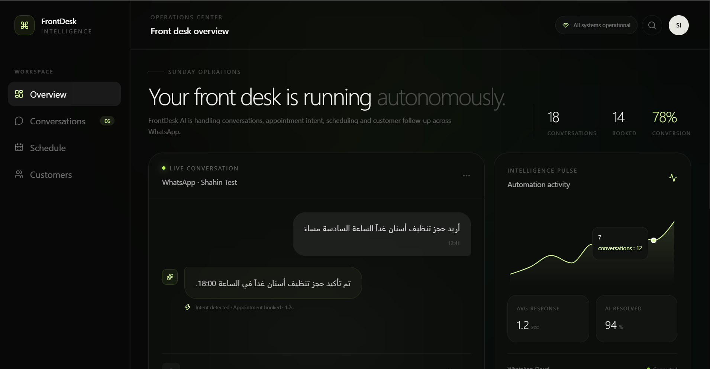

<div align="center">

# FrontDesk AI

### AI-Powered WhatsApp Receptionist & Appointment Automation

A bilingual AI receptionist that understands natural conversations, remembers context across messages, checks appointment availability, and automatically books appointments through WhatsApp.

**Arabic & English · Multi-turn Memory · Real WhatsApp Integration · Local AI**

</div>

<p align="center">
  
</p>

---

## Overview

FrontDesk AI is an AI-powered virtual receptionist designed for clinics, salons, offices, and service businesses.

Instead of forcing customers to fill forms or navigate booking interfaces, FrontDesk AI allows them to book appointments naturally through WhatsApp.

A customer can simply write:

> أريد حجز تنظيف أسنان غداً الساعة الرابعة

FrontDesk AI understands that the time is ambiguous and asks:

> هل تقصد الوقت صباحًا أم مساءً؟

The customer can then reply with only:

> مساءً

The system remembers the previous conversation, resolves the time to `16:00`, checks database availability, creates the appointment, and sends the confirmation automatically.

The same flow also works in English.

---

## Why FrontDesk AI?

Traditional appointment systems often require customers to:

- Visit a website
- Navigate a booking interface
- Select a service
- Choose a date and time manually
- Complete multiple form fields

FrontDesk AI replaces that process with a natural conversation.

```text
Customer
   ↓
WhatsApp
   ↓
FrontDesk AI
   ↓
Intent + Entity Extraction
   ↓
Availability Check
   ↓
Appointment Created
   ↓
Automatic Confirmation
```

---

## Key Features

### AI-Powered Intent Understanding

FrontDesk AI uses a local LLM through Ollama to extract structured information from natural language conversations:

```json
{
  "language": "en",
  "intent": "book_appointment",
  "service_name": "تنظيف أسنان",
  "requested_date": "2026-08-16",
  "requested_time": "16:00"
}
```

The AI is responsible for understanding the request.

Laravel remains responsible for business rules and database operations.

---

### Multi-Turn Conversation Memory

FrontDesk AI can continue incomplete conversations instead of treating every WhatsApp message as a new request.

Example:

```text
Customer:
I want a teeth cleaning on August 16 at four

FrontDesk AI:
Do you mean AM or PM?

Customer:
PM

FrontDesk AI:
Your Teeth Cleaning appointment has been confirmed
for 2026-08-16 at 16:00.
```

Conversation state is persisted in PostgreSQL and expires automatically after a defined period.

---

### Arabic & English Support

The same workflow handles both Arabic and English conversations.

```text
Arabic:
أريد حجز تنظيف أسنان غداً الساعة السادسة مساءً

English:
I want to book a teeth cleaning tomorrow at 6 PM
```

FrontDesk AI detects the customer's language and returns the final response in the same language.

---

### Real WhatsApp Integration

The project integrates directly with the WhatsApp Business Cloud API.

Incoming WhatsApp messages trigger the automation pipeline and booking confirmations are returned directly to the customer.

---

### Appointment Conflict Detection

Before creating an appointment, Laravel checks for overlapping confirmed or pending appointments.

Conceptually:

```text
existing.starts_at < requested.ends_at
AND
existing.ends_at > requested.starts_at
```

If the requested slot is occupied, FrontDesk AI asks the customer to select another time.

---

### AI Guardrails

The LLM is not allowed to make final booking decisions.

For example, when a customer says:

```text
الساعة الرابعة
```

without specifying AM or PM, Laravel prevents the system from accepting an AI-generated guess.

The system asks the customer for clarification instead.

This keeps deterministic business rules outside the LLM.

---

## Architecture



### Responsibility Separation

| Layer | Responsibility |
|---|---|
| WhatsApp Cloud API | Customer messaging |
| n8n | Workflow orchestration |
| Ollama / Qwen | Intent and entity extraction |
| Laravel | Validation and business logic |
| PostgreSQL | Persistent application state |
| React | FrontDesk operations dashboard |
| Docker | Local infrastructure |

---

## Automation Workflow

<p align="center">
  
</p>

The main automation pipeline:

```text
WhatsApp Trigger
        ↓
Edit Fields
        ↓
Save Customer
        ↓
Classify Intent - Ollama
        ↓
Parse AI Result
        ↓
Process Booking
        ↓
Send WhatsApp Reply
```

---

## Operations Dashboard

FrontDesk AI includes a modern operations dashboard concept for visualizing receptionist activity, conversations, appointments, and automation health.

<p align="center">
  
</p>

The dashboard frontend is intentionally presentation-focused for the current MVP.

The production booking engine operates independently through Laravel, PostgreSQL, n8n, Ollama, and WhatsApp.

---

## Technology Stack

### Backend

- Laravel 12
- PHP 8.3
- PostgreSQL
- Carbon
- REST API

### AI

- Ollama
- Qwen
- Structured JSON outputs
- Deterministic AI guardrails

### Automation

- n8n
- WhatsApp Business Cloud API
- Webhooks
- HTTP Request workflows

### Frontend

- React
- TypeScript
- Vite
- Tailwind CSS
- Motion
- Recharts
- Lucide Icons

### Infrastructure

- Docker
- Docker Compose
- Cloudflare Tunnel for development

---

## Database Model

Core application entities:

```text
customers
   │
   ├── appointments
   │
   └── conversation_states

services
   │
   └── appointments
```

### Customers

Stores WhatsApp customers.

### Services

Stores bookable services and their duration.

### Appointments

Stores confirmed appointment ranges and statuses.

### Conversation States

Stores temporary multi-turn conversation context including:

```text
intent
service_name
requested_date
requested_time
waiting_for
context
expires_at
```

---

## Example Booking Flow

### Arabic

```text
Customer:
أريد حجز تنظيف أسنان يوم 15 أغسطس الساعة الرابعة

FrontDesk AI:
هل تقصد الوقت صباحًا أم مساءً؟

Customer:
مساءً

FrontDesk AI:
تم تأكيد حجز تنظيف أسنان بتاريخ 2026-08-15
في الساعة 16:00.
```

### English

```text
Customer:
I want to book a teeth cleaning on August 16 at four

FrontDesk AI:
Do you mean AM or PM?

Customer:
PM

FrontDesk AI:
Your Teeth Cleaning appointment has been confirmed
for 2026-08-16 at 16:00.
```

---

## Local Development

### Requirements

Install:

- Docker Desktop
- PHP 8.3+
- Composer
- Node.js
- Ollama
- n8n through Docker
- PostgreSQL through Docker

---

### Clone

```bash
git clone https://github.com/eenoo2005-star/FrontDesk-AI.git
cd FrontDesk-AI
```

---

### Environment

Copy:

```bash
cp .env.example .env
```

and configure the development values.

Never commit production credentials, access tokens, or API secrets.

---

### Infrastructure

```bash
docker compose up -d
```

---

### Laravel Backend

```bash
cd backend

composer install

cp .env.example .env

php artisan key:generate
php artisan migrate

php artisan serve --host=0.0.0.0 --port=8000
```

---

### Frontend

```bash
cd frontend

npm install
npm run dev
```

---

### Ollama

Install the configured model locally and ensure Ollama is reachable by the n8n Docker container.

Example local endpoint:

```text
http://host.docker.internal:11434
```

---

## Project Structure

```text
FrontDesk-AI/
│
├── backend/
│   ├── app/
│   ├── database/
│   └── routes/
│
├── frontend/
│   └── src/
│
├── n8n/
│   └── workflows/
│       └── 02-whatsapp-incoming-message.json
│
├── docs/
│   └── assets/
│       ├── frontdesk-ai-cover.png
│       ├── dashboard.png
│       └── n8n-workflow.png
│
├── docker-compose.yml
├── .env.example
└── README.md
```

---

## Security

FrontDesk AI follows several important boundaries:

- Secrets are stored in environment variables
- Access tokens are excluded from source control
- The AI model does not directly modify the database
- Laravel validates AI-generated structured data
- Appointment availability is verified server-side
- Ambiguous time inputs require clarification
- Conversation state expires automatically

---

## Current MVP Scope

The current version focuses intentionally on one core workflow:

**AI-assisted appointment booking through WhatsApp.**

Implemented:

- WhatsApp message reception
- AI intent extraction
- Arabic conversation support
- English conversation support
- Customer persistence
- Service recognition
- Appointment creation
- Conflict detection
- Multi-turn conversation memory
- Ambiguous-time clarification
- Automatic WhatsApp confirmations
- Operations dashboard frontend

Future production extensions could include:

- Appointment cancellation
- Appointment rescheduling
- Automated reminders
- Multiple staff calendars
- Business-hours configuration
- Production deployment

---

## Engineering Principles

FrontDesk AI separates probabilistic AI understanding from deterministic business logic.

```text
LLM
↓
Understand what the customer means

Laravel
↓
Decide what the system is allowed to do

PostgreSQL
↓
Store the final source of truth
```

This prevents the AI model from becoming the authority for scheduling decisions.

---

## Built By

**Shaheen Idris**

Software Engineering · Backend Development · Workflow Automation · AI Integration

---

<div align="center">

### FrontDesk AI

**Turning appointment booking into a conversation.**

</div>